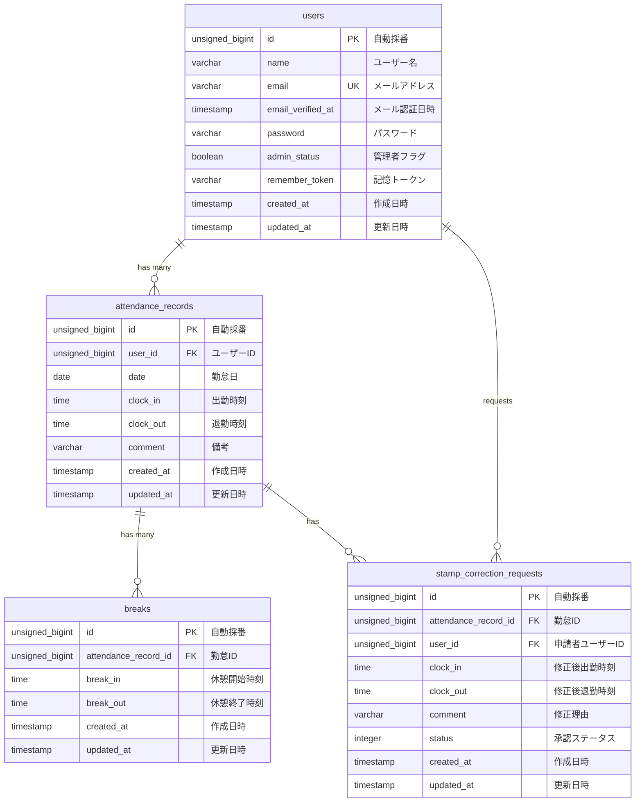

# 勤怠管理システム - Attendance Management System

このリポジトリは、勤怠管理システムの基本的な機能（ユーザー認証、出退勤打刻、勤務履歴の確認、管理者による勤怠管理）に加え、メール認証、修正申請ワークフロー、統計レポート、そしてLaravel Sanctumを用いた公開APIなどの機能までを実装したLaravelプロジェクトです。

## 動作環境

- Docker
- Docker Compose

※ Windowsの場合はWSL2の利用を推奨します。

> Apple Silicon (M1/M2) Mac をお使いの方は、`sail up -d` 実行時にプラットフォームエラーが発生する場合があります。その場合は compose.yaml の該当サービスに `platform: linux/amd64` を追加してください。

## 環境構築手順

1. **リポジトリをクローン**

   ```bash
   git clone https://github.com/yuki1959yuki-crypto/attendance-app.git
   cd attendance-app
   ```

2. **.envファイルの準備**

   `.env.example` をコピーして `.env` を作成します。

   ```bash
   cp .env.example .env
   ```

   `.env` ファイル内の以下のDB接続情報を確認・設定します。デフォルトではLaravel Sailの標準設定になっています。

   ```ini
   DB_CONNECTION=mysql
   DB_HOST=mysql
   DB_PORT=3306
   DB_DATABASE=laravel
   DB_USERNAME=sail
   DB_PASSWORD=password

   MAIL_MAILER=smtp
   MAIL_HOST=mailpit
   MAIL_PORT=1025
   ```

3. **Composer依存パッケージのインストール**

   プロジェクトの初回セットアップ時は、`vendor` ディレクトリが存在しないため `sail` コマンドを使用できません。
   以下のDockerコマンドを実行して、コンテナ内で `composer install` を実行します。

   ```bash
   docker run --rm \
       -u "$(id -u):$(id -g)" \
       -v "$(pwd):/var/www/html" 
       -w /var/www/html \
       -e COMPOSER_CACHE_DIR=/tmp/composer_cache \
       laravelsail/php82-composer:latest \
       composer install
   ```

4. **Laravel Sailの起動**

   以下のコマンドでDockerコンテナを起動します。

   ```bash
   ./vendor/bin/sail up -d
   ```

   > **エイリアスの設定（推奨）**
   > 
   > 毎回 `./vendor/bin/sail` と入力するのは手間なので、エイリアスを設定すると便利です。
   > 
   > ```bash
   > alias sail='[ -f sail ] && bash sail || bash vendor/bin/sail'
   > ```

5. **アプリケーションキーの生成**

   ```bash
   sail artisan key:generate
   ```

6. **データベースのマイグレーションと初期データ投入**

   以下のコマンドでテーブルを作成し、ダミーデータを投入します。

   ```bash
   sail artisan migrate:fresh --seed
   ```

7. **フロントエンドのビルド**

   ```bash
   sail npm install
   sail npm run dev
   ```

   `npm run dev` は開発中は起動したままにしてください。

8. **アプリケーションへのアクセス**

   ブラウザで [http://localhost](http://localhost) にアクセスします。

## 開発環境URL

- アプリケーション: http://localhost
- phpMyAdmin: http://localhost:8080

## ログイン情報（テスト用アカウント）

マイグレーションおよびシード実行後、以下の初期アカウントでログインして各機能を確認できます。

- **一般ユーザー1（検証用データ作成済み）**
  - メールアドレス: `user1@example.com`
  - パスワード: `password`

- **一般ユーザー2**
  - メールアドレス: `user2@example.com`
  - パスワード: `password`

- **管理者ユーザー**
  - メールアドレス: `user3@example.com`
  - パスワード: `password`

## テスト実行

```bash
sail artisan test
```

## API エンドポイント一覧

| メソッド | パス | 概要 |
|----------|------|------|
| GET | `/api/v1/attendance-records` | 勤怠一覧取得 |
| GET | `/api/v1/attendance-records/{attendanceRecord}` | 勤怠詳細取得 |
| POST | `/api/v1/attendance-records` | 勤怠登録 |
| PUT | `/api/v1/attendance-records/{attendanceRecord}` | 勤怠更新 |
| DELETE | `/api/v1/attendance-records/{attendanceRecord}` | 勤怠削除 |

## 機能一覧

- **ユーザー認証機能**
  - Laravel Fortifyを用いた会員登録・ログイン・ログアウト（一般・管理者）
  - メール認証機能および再送機能
- **勤怠打刻・管理機能**
  - 日時情報の取得とリアルタイムなステータス確認（勤務外・出勤中・休憩中・退勤済）
  - 出勤・休憩（複数回対応・休憩戻）・退勤の打刻機能
  - 一般ユーザー向けの月別勤怠一覧確認および日次・月次詳細への遷移
- **修正申請ワークフロー**
  - 一般ユーザーによる勤怠詳細の修正申請と承認待ち・承認済みリストの確認
  - 管理者ユーザーによる日次勤怠一覧・スタッフ一覧・月次勤怠一覧の確認
  - 管理者による修正申請の確認および承認機能（ユーザー側への自動反映）
  - スタッフごとの月次勤怠一覧のCSV出力機能
- **統計レポート機能（応用要件）**
  - 過去6ヶ月の総労働時間・総残業時間・平均労働時間の基本サマリー表示
  - 月次推移の労働・残業時間グラフ表示
  - 遅刻・早退・長時間労働の異常検知回数表示
- **公開API機能（応用要件）**
  - Laravel Sanctumによるトークン認証と、`AttendanceRecordPolicy` による認可制御
  - 勤怠データのRESTful API（一覧取得・詳細取得・登録・更新・削除）とFormRequestバリデーション対応

## 使用技術

- **PHP**: 8.2
- **Laravel**: 10.x
- **MySQL**: 8.4
- **Docker / Laravel Sail**: 開発環境コンテナ化
- **Vite**: フロントエンドビルド（提供CSS / プレーンCSS）
- **Laravel Fortify**: 認証機能
- **Laravel Sanctum**: API認証（応用機能）
- **phpMyAdmin**: DB管理ツール
- **Mailpit**: メール確認ツール

## ER図



## 作成者

松永　有希
